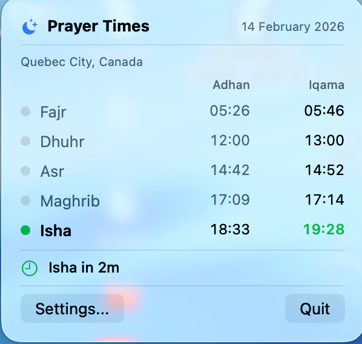
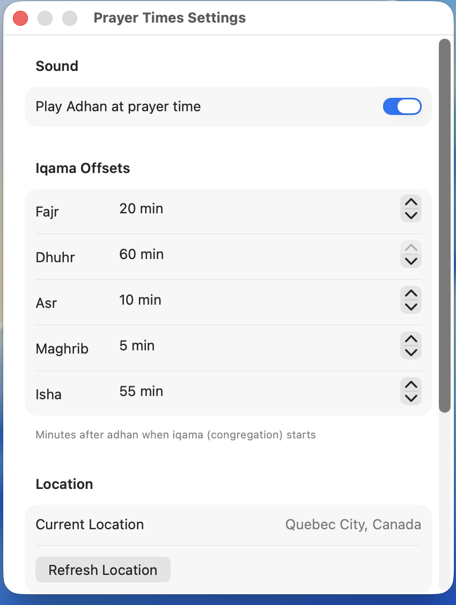

# Prayer Times — Mac Menu Bar App

A free, local, no-BS Mac menu bar app that shows prayer times and plays the full adhan. No in-app purchases, no subscriptions, no API calls — everything calculated locally.

## Features

- **Menu bar icon** with countdown to next prayer
- **5 daily prayers** — Fajr, Dhuhr, Asr, Maghrib, Isha
- **Adhan + Iqama times** — dual column display, configurable iqama offsets per prayer
- **Full adhan playback** at prayer time
- **Auto location** via GPS — no manual setup needed
- **System notifications** at both adhan and iqama times
- **ISNA calculation method** (North America)
- **Launch at login** toggle
- **100% offline** — pure astronomy math, zero API calls
- **Lightweight** — pure SwiftUI, no Electron, no web views

## Screenshots

<p align="center">
  
  &nbsp;&nbsp;&nbsp;&nbsp;
  
</p>

## Install

### Option 1: Download (macOS 13+)

1. Go to [Releases](../../releases)
2. Download `PrayerTimes.zip`
3. Extract and drag `PrayerTimes.app` to `/Applications`
4. Open Terminal and run:
   ```bash
   xattr -cr /Applications/PrayerTimes.app
   ```
   (This removes the macOS quarantine flag — the app is unsigned so Gatekeeper blocks it without this step)
5. Double-click to open
6. Grant location permission when asked

### Option 2: Build from source

```bash
git clone https://github.com/almokhtarbr/mac-prayer-times.git
cd mac-prayer-times
open PrayerTimes.xcodeproj
# Hit Cmd+R to build and run
```

Requires Xcode 15+ and macOS 13+.

## How It Works

The app uses [adhan-swift](https://github.com/batoulapps/adhan-swift) to calculate prayer times from your GPS coordinates using sun position math. No internet needed after the initial location fix.

```
GPS coordinates → adhan-swift (astronomy math) → 5 prayer times
                                                → iqama = adhan + offset
```

### Iqama Times

Each prayer has a configurable iqama offset (minutes after adhan). Defaults:

| Prayer  | Default Offset |
|---------|---------------|
| Fajr    | +20 min       |
| Dhuhr   | +15 min       |
| Asr     | +10 min       |
| Maghrib | +5 min        |
| Isha    | +15 min       |

Change these in Settings to match your local mosque.

## Project Structure

```
PrayerTimes/
├── PrayerTimesApp.swift          # App entry — MenuBarExtra with moon icon
├── Views/
│   ├── MenuBarView.swift         # Dropdown: prayers, adhan/iqama columns, countdown
│   └── SettingsView.swift        # Sound toggle, iqama offsets, launch at login
├── Models/
│   ├── PrayerManager.swift       # Calculates times, schedules notifications, triggers adhan
│   └── LocationManager.swift     # GPS wrapper + reverse geocoding
├── Services/
│   └── AdhanPlayer.swift         # AVFoundation audio player for adhan
├── Resources/
│   └── adhan.mp3                 # Full adhan audio (~3 min)
├── Assets.xcassets/
├── Info.plist                    # LSUIElement=YES (menu bar only)
└── PrayerTimes.entitlements
```

## Tech Stack

- **SwiftUI** with `MenuBarExtra` (macOS 13+)
- **[adhan-swift](https://github.com/batoulapps/adhan-swift)** v1.4.0 — prayer time calculation
- **AVFoundation** — adhan audio playback
- **CoreLocation** — auto-detect location
- **UserNotifications** — prayer time alerts
- **ServiceManagement** — launch at login

## Configuration

All settings persist across launches:

- **Adhan sound** — on/off toggle
- **Iqama offsets** — per-prayer, 0-60 minutes, step of 5
- **Launch at login** — uses macOS native `SMAppService`
- **Calculation method** — ISNA (North America) — hardcoded for now

## Roadmap

**High priority:**
- [ ] [Hijri date in header](../../issues/1)
- [ ] [Countdown to iqama](../../issues/2)
- [ ] [Fajr tomorrow after Isha](../../issues/3)
- [ ] [Calculation method picker](../../issues/4)
- [ ] [Friday / Jumuah mode](../../issues/5)

**Medium priority:**
- [ ] [Sunrise row](../../issues/6)
- [ ] [Sound picker](../../issues/7)
- [ ] [Volume control](../../issues/8)
- [ ] [Global keyboard shortcut](../../issues/9)
- [ ] [Quiet hours / DND](../../issues/10)

**Nice to have:**
- [ ] [Qibla compass](../../issues/11)
- [ ] [Ramadan mode](../../issues/12)
- [ ] [Notification Center widget](../../issues/13)
- [ ] [iCloud sync](../../issues/14)
- [ ] [Menu bar display options](../../issues/15)

## License

MIT — do whatever you want with it.

## Credits

- Prayer time calculation: [adhan-swift](https://github.com/batoulapps/adhan-swift) by Batoul Apps
- Built with Claude Code
