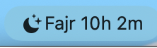

# Prayer Times — Mac Menu Bar App

A free, local, no-BS Mac menu bar app that shows prayer times and plays the full adhan. No in-app purchases, no subscriptions, no API calls — everything calculated locally.

## Features

- **Menu bar countdown** — next prayer name + time always visible in the menu bar
- **6 daily times** — Fajr, Sunrise, Dhuhr, Asr, Maghrib, Isha with adhan & iqama columns
- **Full adhan playback** at prayer time with volume control
- **Jumuah mode** — automatically shows "Jumuah" instead of Dhuhr on Fridays
- **Hijri date** — displayed alongside the Gregorian date
- **Quiet hours / DND** — mute adhan during configurable time windows
- **11 calculation methods** — ISNA, Muslim World League, Egyptian, Umm al-Qura, and more
- **Menu bar display options** — prayer + countdown, countdown only, prayer + time, or icon only
- **Auto location** via GPS — no manual setup needed
- **System notifications** at both adhan and iqama times
- **Notification Center widget** — small and medium sizes
- **Launch at login** toggle
- **100% offline** — pure astronomy math, zero API calls
- **Lightweight** — pure SwiftUI, no Electron, no web views

## Screenshots

<p align="center">
  
</p>

<p align="center">
  
  &nbsp;&nbsp;&nbsp;&nbsp;
  
</p>

<p align="center">
  
</p>

## Install

### Option 1: Download (macOS 14+)

1. Go to [Releases](../../releases)
2. Download `PrayerTimes.dmg`
3. Open the DMG and drag `PrayerTimes.app` to `Applications`
4. Open Terminal and run:
   ```bash
   xattr -cr /Applications/PrayerTimes.app
   ```
   (This removes the macOS quarantine flag — the app is unsigned so Gatekeeper blocks it without this step)
5. Double-click to open
6. Grant location permission when asked

### Option 2: Build from source

```bash
git clone https://github.com/almokhtarbr/mac-prayer-times.git
cd mac-prayer-times
open PrayerTimes.xcodeproj
# Hit Cmd+R to build and run
```

Requires Xcode 15+ and macOS 14+.

## How It Works

The app uses [adhan-swift](https://github.com/batoulapps/adhan-swift) to calculate prayer times from your GPS coordinates using sun position math. No internet needed after the initial location fix.

```
GPS coordinates → adhan-swift (astronomy math) → 6 prayer times (incl. sunrise)
                                                → iqama = adhan + offset
```

### Iqama Times

Each prayer has a configurable iqama offset (minutes after adhan). Defaults:

| Prayer  | Default Offset |
|---------|---------------|
| Fajr    | +20 min       |
| Dhuhr   | +15 min       |
| Asr     | +10 min       |
| Maghrib | +5 min        |
| Isha    | +15 min       |

Change these in Settings to match your local mosque.

## Project Structure

```
PrayerTimes/
├── PrayerTimesApp.swift          # App entry — MenuBarExtra with moon icon
├── Views/
│   ├── MenuBarView.swift         # Dropdown: prayers, adhan/iqama columns, countdown
│   └── SettingsView.swift        # Sound, volume, DND, iqama offsets, display mode
├── Models/
│   ├── PrayerManager.swift       # Calculates times, schedules notifications, triggers adhan
│   └── LocationManager.swift     # GPS wrapper + reverse geocoding
├── Services/
│   ├── AdhanPlayer.swift         # AVFoundation audio player with volume control
│   └── SettingsSync.swift        # iCloud KVS sync (ready for paid dev account)
├── Resources/
│   └── adhan.mp3                 # Full adhan audio (~3 min)
├── Assets.xcassets/
├── Info.plist                    # LSUIElement=YES (menu bar only)
└── PrayerTimes.entitlements
PrayerTimesWidget/
├── PrayerTimesWidget.swift       # Notification Center widget (small + medium)
├── Info.plist
└── PrayerTimesWidget.entitlements
```

## Tech Stack

- **SwiftUI** with `MenuBarExtra` (macOS 14+)
- **[adhan-swift](https://github.com/batoulapps/adhan-swift)** v1.4.0 — prayer time calculation
- **AVFoundation** — adhan audio playback with volume control
- **CoreLocation** — auto-detect location
- **UserNotifications** — prayer time alerts
- **WidgetKit** — Notification Center widget
- **ServiceManagement** — launch at login

## Configuration

All settings persist across launches:

- **Adhan sound** — on/off toggle with volume slider (0–100%)
- **Quiet hours** — configurable time range to mute adhan (notifications still appear)
- **Iqama offsets** — per-prayer, 0–60 minutes, step of 5
- **Menu bar display** — 4 modes: prayer + countdown, countdown only, prayer + time, icon only
- **Calculation method** — 11 methods including ISNA, MWL, Egyptian, Umm al-Qura, etc.
- **Launch at login** — uses macOS native `SMAppService`

## Roadmap

- [x] [Hijri date in header](../../issues/1)
- [x] [Countdown to iqama](../../issues/2)
- [x] [Fajr tomorrow after Isha](../../issues/3)
- [x] [Calculation method picker](../../issues/4)
- [x] [Friday / Jumuah mode](../../issues/5)
- [x] [Sunrise row](../../issues/6)
- [x] [Volume control](../../issues/8)
- [x] [Quiet hours / DND](../../issues/10)
- [x] [Notification Center widget](../../issues/13)
- [x] [Menu bar display options](../../issues/15)
- [ ] [Sound picker — multiple adhan recordings](../../issues/7)
- [ ] [Global keyboard shortcut](../../issues/9)
- [ ] [Qibla compass](../../issues/11)
- [ ] [Ramadan mode](../../issues/12)
- [ ] [iCloud sync](../../issues/14) (code ready, needs paid dev account)

## License

MIT — do whatever you want with it.

## Credits

- Prayer time calculation: [adhan-swift](https://github.com/batoulapps/adhan-swift) by Batoul Apps
- Built by [almokhtar](https://github.com/almokhtarbr)
